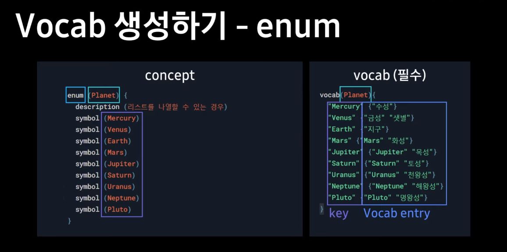
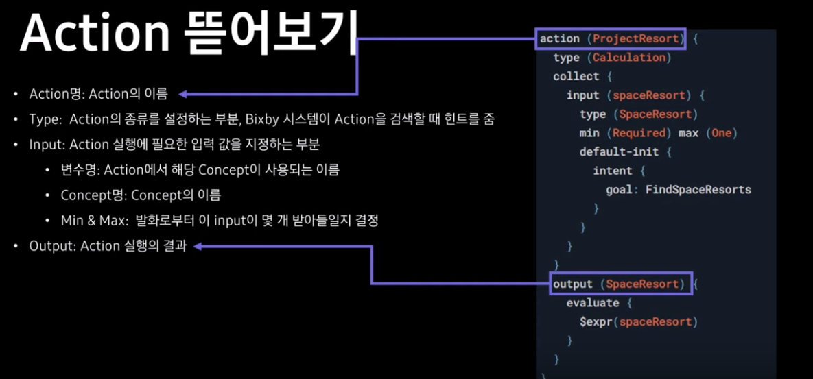

# Bixby Lecture


## Bixby 서비스 아키텍처와 Capsule 구조

### Bixby 서비스 아키텍처


1. Client : 사용자 발화 >> 빅스비 서버로 전달
2. ASR : 위의 발화를 문자로 변환
3. NLU: 문자로 변환된 발화가 어떤 캡슐로 가야하는지 분류
   * Intent: 어떤 의도 인지
   * Value: 필요한 값
4. Plan: 결과값을 얻기위해 실행해야하는 할일을 순서도로 나타내는 것(이때 JS코드가 실행 됨)
   * Plan은 캡슐을 기반으로 생성 됨
5. 6. 외부서버와 통신이 필요한 경우

7.  사용자에게 결과를 알려줌


#### Plan Graph 예시


### Bixby Capsule 구조


1. 모델링: 값과 그 값을 활용할 동작을 정의
   * Concept: 사용자의 발화를 인식하고 리턴할 때 필요한 값
   * Actions: 작업을 이해하도록 수행할 동작
2. 비즈니스 로직: 작업을 실제 수행할 JS 코드를 작성
3. UI/UX: 
   * Views: 최종 결과를 사용자에게 어떻게 보여줄지 작업하는 것
   * Dialog: 사용자에게 되묻거나 결과를 응답해주는 응답문 작성
4. 트레이닝: Capsule이 잘 동작하도록 다양한 경우의 발화를 Training 하는 것


## Bixby Capsule 개발기본개념

### Modeling


### Business Logic

```bixby
endpoints {
	action-endpoints {
		action-endpoint (*model/action에 필요한 action파일을 연결*) {
			accepted-inputs (*JS파일에서 쓸 변수를 설정*)
			local-endpoint (*code에 필요한 js파일을 연결*)
		}
	}
}
```


### Training

* 캡슐에서 사용될 다양한 발화를 트레이닝하는 곳


### Views


* match: 각 뷰에서 보여질 데이터를 담은 명시하는 부분(.model과 연결)
* message: 해당 뷰에서 빅스비가 이 캡슐에 상황에 맞도록 사용자에게 어떠한 말을 하게 할지를 명시하는 부분(.dialog파일의 세부내용과 연결)
* render: 실제 해당화면에 어떤 방식으로 데이터를 보여줄지 명시(.layout과 연결)


## Modeling - Action & Concept

### Action

```bixby
action(1) {
	type(2)
	collect {
		input(3) {
			type(4)
			min(5-1) max(5-2)
		}
		
		input() {
			type()
			min() max()
		}
		...
	}
	output(6) {
	
	}
}
```

1. Action명: action의 이름
2. Type: Action의 종류를 설정하는 부분, Bixby 시스템이 Action을 검색할 때 힌트를 줌
3. Input: Action에서 해당 Concept이 사용되는 이름
4. Type: .Model 파일의 이름
5. min, max
   1. min: Required와 Optional
   2. max: One과 Many
6. Action 실행의 결과를 담는 것(.model 파일을 넣어준다.)


### Model


## 유연한 Modeling을 만드는 여러 기법

### Validation


* Input block 안에 넣어서 사용


### Relaxation


* Validation과 유사하지만 Output에서 사용된다는 점만 다르다.


### Throws


### Defalut init


* 위의 코드에서 phoneInfo가 없을 경우 ShowPhoneList액션을 실행하라는 의미


### Evaluate


*  일반적으로 action에서 output을 만들기 위한 JS코드가 필요함
* 하지만, action의 입력값을 그대로 전달하는 간단한 로직의 경우 Evaluate를 사용함.
* 이렇게 되면 JS파일과 endpoint에 코드를 작성하는 일을 줄여줌


### Input group


### Computed input


* 해당 액션의 input값을 가져오거나
* 다른 액션에서 다른 concept값을 가져옴
* Color에 대한 인풋값을 받을 때 해당 action에 다른 인풋 값(applySelection)이 존재하면 GetColorList action을 실행해서 PhoneColor Concept을 가져오라는 의미


### Role-of와 Extentds


## Bixby Business Logic 구현

### Action과 Javascript


### 내장 API

#### Config


* Capsule.properties파일을 만들어 사용할 수 있다.


#### Console


* 디버깅 툴에서 function에서 확인할 수 있다


#### Dates


#### Fail


* 이름을 정해서 사용한다.


#### http


#### secret


* 외부 API키 등을 안전하게 저장하는 것
* config와 차이점으로 config는 로컬에 저장하지만 secret은 빅스비 서버에 저장한다.


## Bixby Capsule 디자인

### 개요


### Bixby Views

#### 종류


#### 구성요소


#### 예시


* Dialog는 message와 // Layout은 render와 // Follow-Up은 Conversation-driver와 관련있다.


## 문자열 컨셉의 종류와 구분과 vocab 사용하기

문자열 컨셉의 종류는 Enum, Name, Text가 있다.


### 문자열의 종류와 구분

#### Enum


* 범위가 한정된 closed type의 컨셉
* 반드시 Vocab이 필요


#### Name


#### Text


#### 정리


### Vocab이란




* enum의 경우 vocab이 필수!


### 제약사항


## 자연어 학습하기





